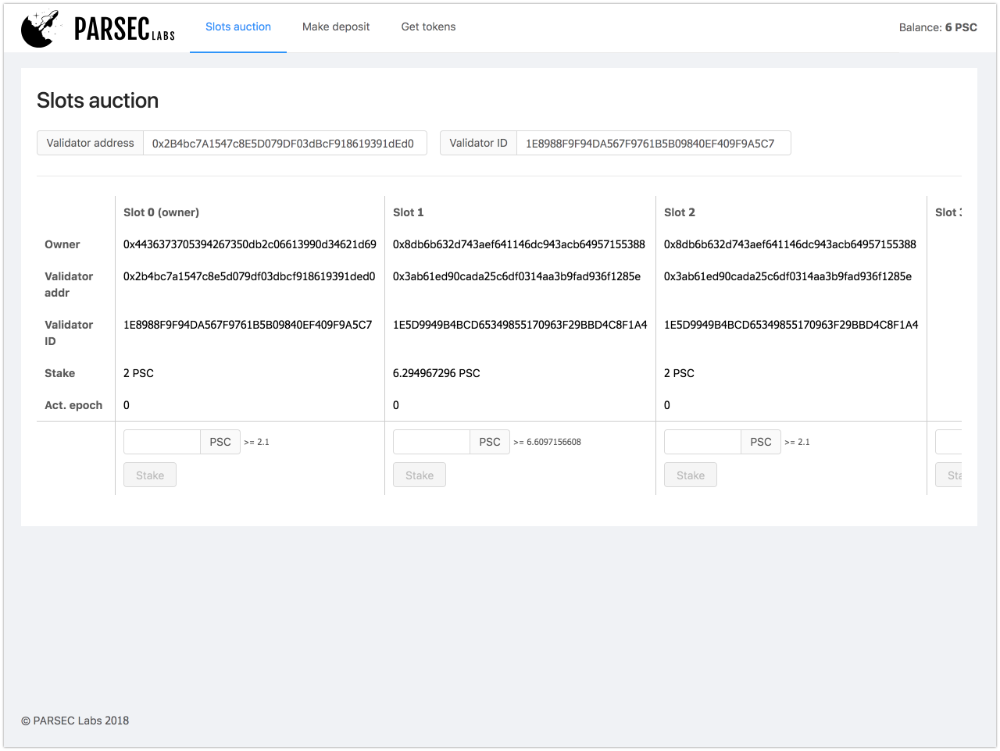

# UI for PARSEC Labs plasma bridge contract

[](http://makeapullrequest.com)



You can:

- View and buy slots
- Make deposit
- Exit UTXOs
- Browse network with block explorer
- Register token contract
- Get some tokens
- ...

## Links

Dev: http://stake-dev.parseclabs.org/

Testnet: N/A

Mainnet: N/A

## Install

`yarn`

## Run locally

```
NETWORK_ID=4 BRIDGE_ADDR=0x099303c83fda47570b255a8fcebf5f8dd86e015e yarn start
```

## Build for deployment

Provide proper network id and addresses for token and bridge contracts.

```
NETWORK_ID=4 BRIDGE_ADDR=0x099303c83fda47570b255a8fcebf5f8dd86e015e yarn run build
```

## Deploy to S3

Dev: `yarn run deploy:dev`

Testnet: `yarn run deploy:testnet`

Mainnet: `yarn run deploy:mainnet`
